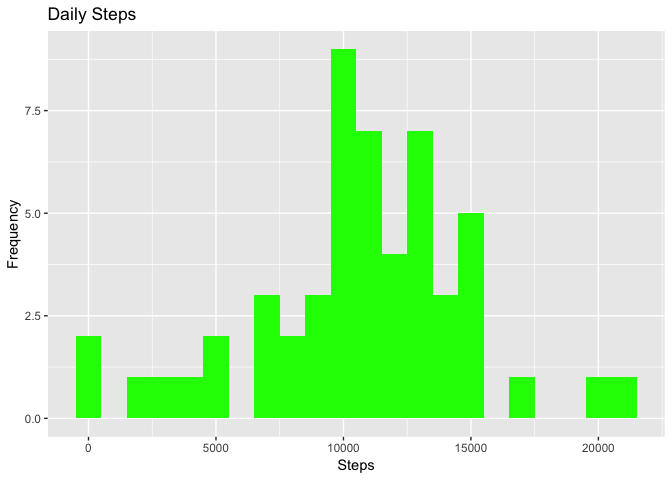
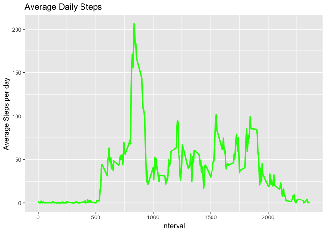
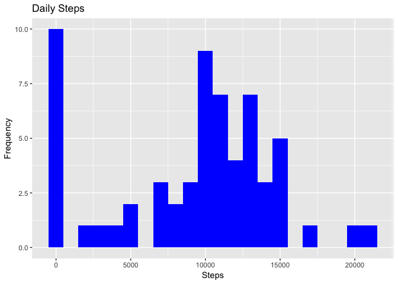
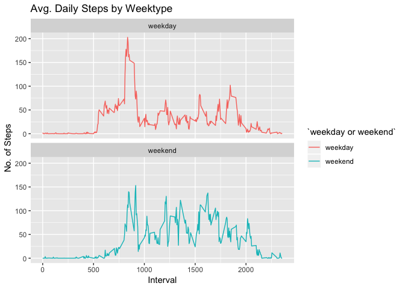

R Markdown
----------

It is now possible to collect a large amount of data about personal
movement using activity monitoring devices such as a Fitbit, Nike
Fuelband, or Jawbone Up. These type of devices are part of the
“quantified self” movement – a group of enthusiasts who take
measurements about themselves regularly to improve their health, to find
patterns in their behavior, or because they are tech geeks. But these
data remain under-utilized both because the raw data are hard to obtain
and there is a lack of statistical methods and software for processing
and interpreting the data.

This assignment makes use of data from a personal activity monitoring
device. This device collects data at 5 minute intervals through out the
day. The data consists of two months of data from an anonymous
individual collected during the months of October and November, 2012 and
include the number of steps taken in 5 minute intervals each day.

The variables included in this dataset are:

-   steps: Number of steps taking in a 5-minute interval (missing values
    are coded as NA)
-   date: The date on which the measurement was taken in YYYY-MM-DD
    format
-   interval: Identifier for the 5-minute interval in which measurement
    was taken

The dataset is stored in a comma-separated-value (CSV) file and there
are a total of 17,568 observations in this dataset.

Downloading the data
--------------------

Download the data from the link and unzip the data to obtain the single
csv file.

    library("data.table")

    ## Warning: package 'data.table' was built under R version 3.4.4

    library("dplyr")

    ## Warning: package 'dplyr' was built under R version 3.4.4

    ## 
    ## Attaching package: 'dplyr'

    ## The following objects are masked from 'package:data.table':
    ## 
    ##     between, first, last

    ## The following objects are masked from 'package:stats':
    ## 
    ##     filter, lag

    ## The following objects are masked from 'package:base':
    ## 
    ##     intersect, setdiff, setequal, union

    library("ggplot2")

    ## Warning: package 'ggplot2' was built under R version 3.4.4

    path <- getwd()
    download.file(url = "https://d396qusza40orc.cloudfront.net/repdata%2Fdata%2Factivity.zip"
                  , destfile = paste(path, "dataFiles.zip", sep = "/"))
    unzip(zipfile = "dataFiles.zip")

Reading the data
----------------

    activity <- fread("activity.csv")

What is the mean total number of steps taken per day?
-----------------------------------------------------

1.  Calculate the total number of steps taken per day (ignore the
    missing values)

<!-- -->

    totStep <- aggregate(steps~date, activity, sum, na.action = NULL)

    head(totStep,5)

    ##         date steps
    ## 1 2012-10-01    NA
    ## 2 2012-10-02   126
    ## 3 2012-10-03 11352
    ## 4 2012-10-04 12116
    ## 5 2012-10-05 13294

1.  Make a histogram of total number of steps taken each day

<!-- -->

    ggplot(totStep, aes(x = steps)) +
            geom_histogram(fill = "green", binwidth = 1000) +
            labs(title = "Daily Steps", x = "Steps", y = "Frequency")

    ## Warning: Removed 8 rows containing non-finite values (stat_bin).

1.  Calculate and report the mean and median of total number of steps
    taken per day

<!-- -->

    meanSteps <- as.character(mean(totStep$steps, na.rm = TRUE))
    medianSteps <- as.character(median(totStep$steps, na.rm = TRUE))

    print(paste0("Mean: ", meanSteps) )

    ## [1] "Mean: 10766.1886792453"

    print(paste0("Median: ", medianSteps) )

    ## [1] "Median: 10765"

What is the average daily activity pattern?
-------------------------------------------

1.  Make a time series plot (i.e type ="1") of the 5-minute
    interval (x-axis) and the average number of steps taken, averaged
    across all days (y-axis)

<!-- -->

    interval <- activity[, c(lapply(.SD, mean, na.rm = TRUE)), .SDcols = c("steps"), by = .(interval)] 
    ggplot(interval, 
           aes(x = interval , y = steps)) + 
            geom_line(color="green", size=1) + 
            labs(title = "Average Daily Steps", x = "Interval", y = "Average Steps per day")

1.  Which 5-minute interval, on average across all the days in the
    dataset, contains the maximum number of steps?

<!-- -->

    interval[steps == max(steps), .(max_interval = interval)]

    ##    max_interval
    ## 1:          835

Imputing missing values
-----------------------

Note that there are a number of days/intervals where there are missing
values (coded as NA). The presence of missing days may introduce bias
into some calculations or summaries of the data.

1.  Calculate and report the total number of missing values in the
    dataset (i.e. the total number of rows with NAs)

<!-- -->

    sum(is.na(activity))

    ## [1] 2304

1.  Devise a strategy for filling in all of the missing values in
    the dataset. The strategy does not need to be sophisticated. For
    example, you could use the mean/median for that day, or the mean for
    that 5-minute interval, etc.

<!-- -->

    activity_noNA <- activity %>% 
            mutate(steps= ifelse(is.na(steps),
                                 activity[, c(lapply(.SD, median, na.rm = TRUE)), .SDcols = c("steps")], 
                                 steps))

    ## Warning: package 'bindrcpp' was built under R version 3.4.4

1.  Create a new dataset that is equal to the original dataset but with
    the missing data filled in. data.table::fwrite(x = activityDT, file
    = "data/tidyData.csv", quote = FALSE)

<!-- -->

    data.table::fwrite(x = activity_noNA, file = "tidyData.csv", quote = FALSE)

1.  Make a histogram of the total number of steps taken each day and
    Calculate and report the mean and median total number of steps taken
    per day. Do these values differ from the estimates from the first
    part of the assignment? What is the impact of imputing missing data
    on the estimates of the total daily number of steps?

<!-- -->

    # group steps by date
    totStep <- aggregate(as.integer(steps)~date, activity_noNA, sum)
    colnames(totStep) <- c("date","step")

    ggplot(totStep, aes(x = step)) +
            geom_histogram(fill = "blue", binwidth = 1000) +
            labs(title = "Daily Steps", x = "Steps", y = "Frequency")

    meanStepsNoNA <- mean(totStep$step)
    medianStepsNoNA <- median(totStep$step)

There is a difference, please see the outputs below:

    ## [1] "With NA Mean: 10765"

    ## [1] "With NA Filled with Median Mean: 9354.22950819672"

    ## [1] "With NA Median: 10765"

    ## [1] "With NA Filled with Median Median: 10395"

Are there differences in acitivity patterns between weekdays and weekends?
--------------------------------------------------------------------------

1.  Create a new factor variable in the dataset with two levels –
    “weekday” and “weekend” indicating whether a given date is a weekday
    or weekend day.

<!-- -->

    activity[, date := as.POSIXct(date, format = "%Y-%m-%d")]
    activity[, `Day of Week`:= weekdays(x = date)]
    activity[grepl(pattern = "Monday|Tuesday|Wednesday|Thursday|Friday", x = `Day of Week`), "weekday or weekend"] <- "weekday"
    activity[grepl(pattern = "Saturday|Sunday", x = `Day of Week`), "weekday or weekend"] <- "weekend"
    activity[, `weekday or weekend` := as.factor(`weekday or weekend`)]
    head(activity, 10)

    ##     steps       date interval Day of Week weekday or weekend
    ##  1:    NA 2012-10-01        0      Monday            weekday
    ##  2:    NA 2012-10-01        5      Monday            weekday
    ##  3:    NA 2012-10-01       10      Monday            weekday
    ##  4:    NA 2012-10-01       15      Monday            weekday
    ##  5:    NA 2012-10-01       20      Monday            weekday
    ##  6:    NA 2012-10-01       25      Monday            weekday
    ##  7:    NA 2012-10-01       30      Monday            weekday
    ##  8:    NA 2012-10-01       35      Monday            weekday
    ##  9:    NA 2012-10-01       40      Monday            weekday
    ## 10:    NA 2012-10-01       45      Monday            weekday

1.  Make a panel plot containing a time series plot (i.e.type =1) of the
    5-minute interval (x-axis) and the average number of steps taken,
    averaged across all weekday days or weekend days (y-axis). See the
    README file in the GitHub repository to see an example of what this
    plot should look like using simulated data.

<!-- -->

    activity[is.na(steps), "steps"] <- activity[, c(lapply(.SD, median, na.rm = TRUE)), .SDcols = c("steps")]
    interval <- activity[, c(lapply(.SD, mean, na.rm = TRUE)), .SDcols = c("steps"), by = .(interval, `weekday or weekend`)] 

    ggplot(interval , aes(x = interval , y = steps, color=`weekday or weekend`)) + 
            geom_line() + 
            labs(title = "Avg. Daily Steps by Weektype", x = "Interval", y = "No. of Steps") + 
            facet_wrap(~`weekday or weekend` , ncol = 1, nrow=2)

