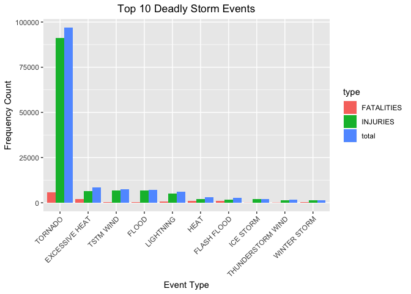

Assignment
----------

The basic goal of this assignment is to explore the NOAA Storm Database
and answer some basic questions about severe weather events. You must
use the database to answer the questions below and show the code for
your entire analysis. Your analysis can consist of tables, figures, or
other summaries. You may use any R package you want to support your
analysis.

Download and load the data
--------------------------

    library("data.table")

    ## Warning: package 'data.table' was built under R version 3.4.4

    library("ggplot2")

    ## Warning: package 'ggplot2' was built under R version 3.4.4

    library("dplyr")

    ## Warning: package 'dplyr' was built under R version 3.4.4

    ## 
    ## Attaching package: 'dplyr'

    ## The following objects are masked from 'package:data.table':
    ## 
    ##     between, first, last

    ## The following objects are masked from 'package:stats':
    ## 
    ##     filter, lag

    ## The following objects are masked from 'package:base':
    ## 
    ##     intersect, setdiff, setequal, union

    url <- "https://d396qusza40orc.cloudfront.net/repdata%2Fdata%2FStormData.csv.bz2"
    download.file(url, destfile = 'repdata%2Fdata%2FStormData.csv.bz2')

    stormDF <- read.csv("repdata%2Fdata%2FStormData.csv.bz2")

Question 1
----------

1.  Across the United States, which types of events (as indicated in the
    EVTYPE variable) are most harmful with respect to population health?

### Investigate which columns are necessary to answer the question

    health_damage <- stormDF %>% select(EVTYPE, FATALITIES, INJURIES)

    #only keep data where fatalities and injuries are greater than 0
    health_damage <- health_damage %>% filter(FATALITIES >0 | INJURIES >0)

    ## Warning: package 'bindrcpp' was built under R version 3.4.4

    #group by event type and get total for each damage
    tot_healthDamage <- health_damage %>% group_by(EVTYPE) %>% 
            summarise(FATALITIES = sum(FATALITIES), 
                      INJURIES = sum(INJURIES))

    # add in a total column that combines fatalities and injuries, and arrange by greatest total
    tot_healthDamage <- tot_healthDamage %>% mutate(total = FATALITIES + INJURIES) %>% arrange(desc(total))

    # only graph the top 10 events
    top10_healthDamage<- tot_healthDamage[1:10,]

    # melt the data frame to present it better in bar graph
    top10_healthDamage <- melt(top10_healthDamage, id.vars="EVTYPE", variable.name = "type")

    # create the bar graph
    health_graph <- ggplot(top10_healthDamage, aes(x=reorder(EVTYPE, -value), y=value)) +
            geom_bar(stat="identity", aes(fill=type), position="dodge") +
            ylab("Frequency Count") +
            xlab("Event Type") +
            ggtitle("Top 10 Deadly Storm Events") + 
            theme(plot.title = element_text(hjust = 0.5))+
            theme(axis.text.x = element_text(angle=45, hjust=1))

    health_graph

1.  Across the United States, which types of events have the greatest
    economic consequences? Consider writing your report as if it were to
    be read by a government or municipal manager who might be
    responsible for preparing for severe weather events and will need to
    prioritize resources for different types of events. However, there
    is no need to make any specific recommendations in your report.

<!-- -->

    econ_damage <- stormDF %>% select(EVTYPE, PROPDMG, PROPDMGEXP, CROPDMG, CROPDMGEXP)

    #filter to where damages > 0
    econ_damage <- econ_damage %>% filter(PROPDMG> 0 | CROPDMG>0 )

    #change all the values in PROPDMGEXP and  CROPDMGEXP to upper case:
    econ_damage<- mutate_all(econ_damage, funs(toupper))

    #convert data frame to data table
    econ_damage <- as.data.table(econ_damage)

    # map keys to values
    propDmgKey <-  c("\"\"" = 10^0,
                     "-" = 10^0, 
                     "+" = 10^0,
                     "0" = 10^0,
                     "1" = 10^1,
                     "2" = 10^2,
                     "3" = 10^3,
                     "4" = 10^4,
                     "5" = 10^5,
                     "6" = 10^6,
                     "7" = 10^7,
                     "8" = 10^8,
                     "9" = 10^9,
                     "H" = 10^2,
                     "K" = 10^3,
                     "M" = 10^6,
                     "B" = 10^9)

    # map keys to values
    cropDmgKey <-  c("\"\"" = 10^0,
                     "?" = 10^0, 
                     "0" = 10^0,
                     "K" = 10^3,
                     "M" = 10^6,
                     "B" = 10^9)

    econ_damage[, PROPDMGEXP := propDmgKey[as.character(econ_damage[,PROPDMGEXP])]]
    econ_damage[is.na(PROPDMGEXP), PROPDMGEXP := 10^0 ]

    econ_damage[, CROPDMGEXP := cropDmgKey[as.character(econ_damage[,CROPDMGEXP])] ]
    econ_damage[is.na(CROPDMGEXP), CROPDMGEXP := 10^0 ]
            

    #calculate damange cost for crop and property
    econ_damage <- econ_damage %>% mutate(propDamCost = as.numeric(PROPDMG) *as.numeric(PROPDMGEXP)) %>%
            mutate(cropDamCost = as.numeric(CROPDMG)*as.numeric(CROPDMGEXP))

    #group by event type and get total for each damage
    tot_econ_damage <- econ_damage %>% group_by(EVTYPE) %>% 
            summarise(propDamCost = sum(propDamCost), 
                      cropDamCost = sum(cropDamCost))

    # add in a total column and arrange by greatest total
    tot_econ_damage <- tot_econ_damage %>% mutate(total = cropDamCost + propDamCost) %>% arrange(desc(total))

    # only graph the top 10 events
    top10_econDamage<- tot_econ_damage[1:10,]

    # melt the data frame to present it better in bar graph
    top10_econDamage <- melt(top10_econDamage, id.vars="EVTYPE", variable.name = "type")

    # create the bar graph
    econ_graph <- ggplot(top10_econDamage, aes(x=reorder(EVTYPE, -value), y=value)) +
            geom_bar(stat="identity", aes(fill=type), position="dodge") +
            ylab("Cost(US Dollars)") +
            xlab("Event Type") +
            ggtitle("Top 10 Economically Damaging Storm Events") + 
            theme(plot.title = element_text(hjust = 0.5))+
            theme(axis.text.x = element_text(angle=45, hjust=1))

    econ_graph

